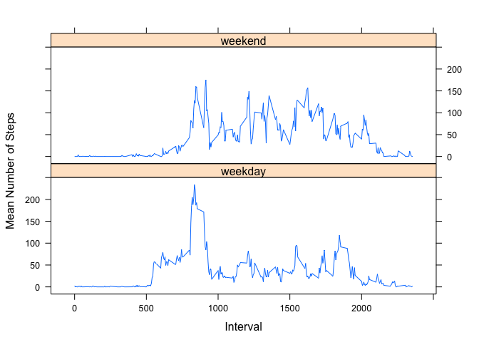

# Reproducible Research: Peer Assessment 1


## Loading and preprocessing the data

```r
# read data, download if necessary
# fileUrl <- "https://d396qusza40orc.cloudfront.net/repdata%2Fdata%2Factivity.zip"
# download.file(fileUrl, destfile="activity.zip", method="curl")
unzip("activity.zip")
activity <- read.csv("activity.csv", stringsAsFactors=FALSE, colClasses=c("numeric","Date","numeric"))
```


## What is mean total number of steps taken per day?

```r
# mean and median steps/day
meanSteps <- with(activity, round(mean(steps, na.rm=TRUE), 1))
meanSteps
```

```
## [1] 37.4
```

```r
medSteps <- with(activity, median(steps, na.rm=TRUE))
medSteps
```

```
## [1] 0
```

The mean number of steps/day was 37.4, and the median 0.


```r
# histogranm of steps/day
with(activity, hist(steps, xlab="Steps/Day"))
```

 


## What is the average daily activity pattern?
Next, we examine the daily activity pattern and determine during the which the maximum number of steps were taken.


```r
# time series plot by 5-minute intervals
meanByInt <- aggregate(steps ~ interval, data = activity, function(x) mean(x, na.rm=TRUE))
# with(meanByInt, ggplot2::qplot(interval, steps, geom="line", xlab="Interval", ylab="Mean Steps"))
with(meanByInt, plot(interval, steps, type="l", xlab="Interval", ylab="Mean Steps"))
```

 

```r
# interval with max number of steps
intervalMax <- subset(meanByInt, steps==max(steps))$interval
intervalMax
```

```
## [1] 835
```
The maximum number of steps were taken in interval 835.


## Imputing missing values

```r
# number of observations with missing values
nMiss <- sum(is.na(activity$steps))
nMiss
```

```
## [1] 2304
```
There were 2304 missing step values.  Missing values were then imputed by sampling the nonmissings.


```r
# impute missing values by sampling from the nonmissing for new dataset activityImp
activityImp <- activity
activityImp[is.na(activityImp$steps), "steps"] <- with(activity, sample(steps[!is.na(steps)], sum(is.na(activity$steps)), replace=TRUE))
```

The histogram displays the dataset with imputed values.

```r
# histogram steps/day including imputed values
with(activityImp, hist(steps, xlab="Steps/Day", main="Histogram Steps (imputed missing values)"))
```

 

```r
# difference between mean and medians with imputed values
# mean
meanDiff <- round(mean(activity$steps, na.rm=T) - mean(activityImp$steps),3); meanDiff
```

```
## [1] 0.072
```

```r
medDiff <- median(activity$steps, na.rm=T) - median(activityImp$steps); medDiff
```

```
## [1] 0
```
When missing values for steps are imputed, the mean value differs from the complete case mean by 0.072, and the median by 0 (i.e, medians were identical).


## Are there differences in activity patterns between weekdays and weekends?
Finally, we examine activity patterns according to weekend or weekday activity graphically.

```r
# variable to distinguish weekend and weekday  
activity$workday <- factor(with(activity, weekdays(date) %in% c("Saturday","Sunday")), labels=c("weekday","weekend"))
# create data set to plot
meanByInt <- aggregate(steps ~ interval + workday, data = activity, function(x) mean(x, na.rm=TRUE))
lattice::xyplot(steps ~ interval | workday, t = "l", data = meanByInt, layout = c(1,2), xlab = "Interval", ylab = "Mean Number of Steps")
```

 

The weekend pattern is consistent with sustained activity over the course of waking hours.

